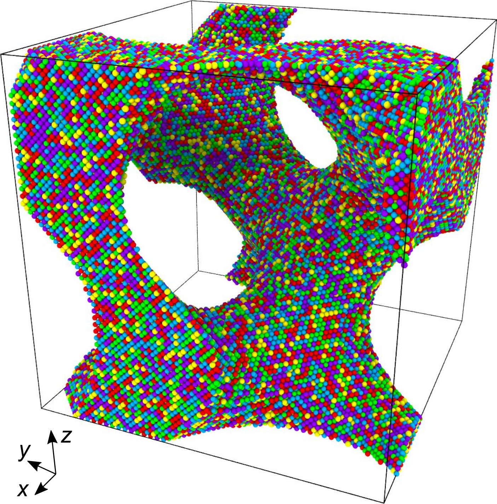

# Porous Alloy

High entropy alloy with gyroid structure, Relative density: $\rho_r = 0.3$

<!--<table>
  <tr>
    <td align="center">
      
      
<small><em>Caption 1</em></small>

    </td>
    <td align="center">
      
      
<small><em>Caption 2</em></small>

    </td>
  </tr>
</table>-->

# Instructions
Dependencies: [ase](https://ase-lib.org/index.html)

Installation: pip, conda, uv or pixi

Run: `python model_alloy.py`

# References

- Van-Lam Nguyen, **Minh-Quan Doan**, Dang Thi Hong Hue, Van-Hai Dinh, Le Van Lich, "Mechanical behavior of high entropy alloys with gyroid nanostructures", *Intermetallics*, Volume 171, **2024**, 108348, ISSN 0966-9795. **DOI:** [10.1016/j.intermet.2024.108348 ](https://doi.org/10.1016/j.intermet.2024.108348)
